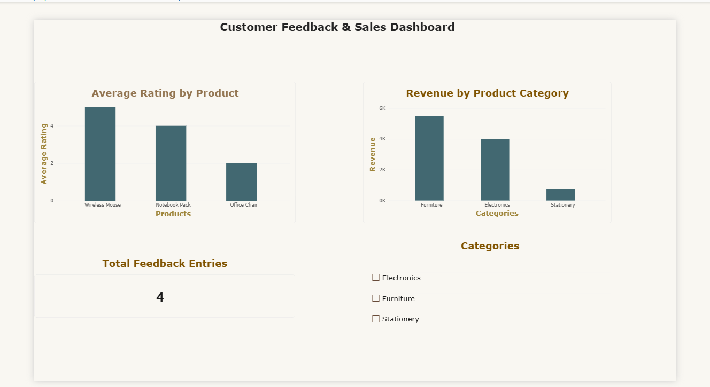

# Customer Feedback & Sales ETL Pipeline
Batch ETL pipeline: MySQL → Python/Pandas → S3 → Redshift-style warehouse → Airflow → Power BI

## Overview
This project is a batch ETL pipeline built to practice and demonstrate the core workflow 
of a data engineering role: extracting raw operational data, cleaning and validating it, 
staging it in cloud storage, loading it into a warehouse, analyzing it with SQL, and 
visualizing the results in a BI dashboard — with the whole workflow orchestrated through 
Apache Airflow.

The pipeline processes customer feedback, product ratings, and sales data, simulating 
a real business use case: tracking product performance and customer sentiment to support 
reporting and decision-making.

## Architecture
MySQL (RDS) 
   → Python / Pandas (extract & curate)
   → Amazon S3 (staging — curated CSVs)
   → PostgreSQL (warehouse layer, used as a Redshift-pattern substitute)
   → SQL analysis (joins, aggregations, subqueries, window functions)
   → Power BI (dashboard)

Orchestration: Apache Airflow (hosted on a separate AWS EC2 instance)

## What Each Stage Does

**1. Source — MySQL (AWS RDS)**
Created and populated 4 relational tables (`customers`, `products`, `feedback`, `sales`) 
representing a small e-commerce-style dataset, including intentionally incomplete records 
(missing comment, missing date) to practice realistic data cleaning.

**2. Extract — Python**
Connected to RDS using `mysql-connector-python` and pulled all 4 tables into Pandas 
DataFrames for processing.

**3. Transform / Curate — Pandas**
- Checked for and handled missing values (filled or dropped, depending on field criticality)
- Standardized data types (dates, numeric fields)
- Removed duplicate records
- Validated record counts before staging

**4. Stage — Amazon S3**
Saved curated datasets as CSV files and uploaded them to an S3 bucket using `boto3`, 
with access managed through a dedicated IAM user.

**5. Load — PostgreSQL (Redshift-pattern substitute)**
Downloaded the curated files from S3 and loaded them into a PostgreSQL database using 
`SQLAlchemy`. PostgreSQL was used in place of Amazon Redshift for this practice project, 
since Redshift isn't fully free-tier friendly — the SQL behavior and query patterns are 
functionally equivalent for this purpose.

**6. Analyze — SQL**
Wrote and ran SQL queries directly against the warehouse covering:
- Joins and aggregations (average rating per product)
- Aggregations (total revenue by category)
- Subqueries (customers who rated below the average)
- Window functions (`RANK()` of products by revenue within each category)

**7. Visualize — Power BI**
Connected Power BI Desktop directly to the PostgreSQL database and built a dashboard 
with:
- Average rating by product (bar chart)
- Revenue by category (column chart, using a DAX `SUMX` measure)
- Total feedback entries (KPI card)
- A category slicer for interactive filtering

**8. Orchestrate — Apache Airflow**
Set up a separate Ubuntu EC2 instance (since Airflow isn't natively supported on Windows), 
installed Airflow via `pip`, and wrote a DAG (`customer_feedback_etl`) with three chained 
tasks — `extract → curate → load` — to automate and schedule the pipeline.

## Tools & Technologies
Python, Pandas, SQL, MySQL, PostgreSQL, Amazon S3, Amazon EC2, Apache Airflow, Power BI, 
boto3, SQLAlchemy, mysql-connector-python

## Dashboard

*Power BI dashboard showing average rating by product, revenue by category, and total 
feedback count, with a category filter.*

## Notes on Scope
- This is a practice project built to reinforce hands-on experience with each stage of 
  a batch ETL pipeline, not a production system.
- PostgreSQL was used as a cost-free substitute for Amazon Redshift; the pipeline logic 
  and SQL patterns transfer directly.
- Sample data was manually created to include realistic data-quality issues (missing 
  values) for cleaning practice.
